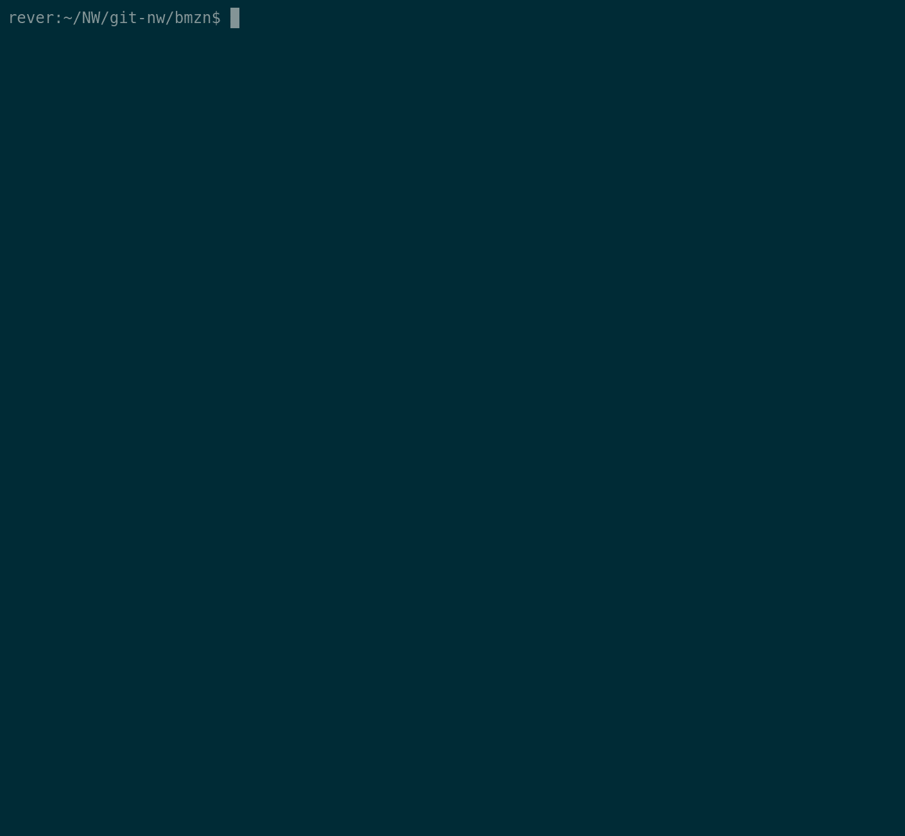

# Bamazon

Welcome to bamazon command line application!
This is a storefront like command line app that will take in orders from customers and show products information to managers.

### Pre-requisites

This app requires node js and a couple npm packages to be installed.

* Install npm packages below.

```
npm install mysql
npm install inquirer
```

### Usage

Currently, there are 2 views available for this app: customer and manager.

### Customer View

Customer view of this application will do the following.

1. Display all of the items available for sale. Include the ids, names, and prices of products for sale.
2. The app should then prompt users with two questions.
    * Ask the ID of the product they would like to buy.
    * Ask how many units of the product they would like to buy.
3. Once the customer has placed the order, it will check if the store has enough quantity to meet the customer's request and do either of the following.
    * If enough items, go through with the order, update the SQL database to reflect the remaining quantity, and show total cost of purchase.
    * If NOT enough items, log "Insufficient quantity..."


Sample Customer flow


### Manager View

Manager view of this application will show the following menu.

1. View Products for Sale
This option lists every available item with the following information: the item IDs, names, prices, and quantities.

2. View Low Inventory
This option lists all items with an inventory count lower than five if there is any.

3. Add to Inventory
This option displays a prompt that will let the manager add more of any item currently in the store.

4. Add New Product
This option allows the manager to add a completely new product to the store.


Sample Manager Flow Viewing Products and Low Inventory


Sample Manager Flow Add to Inventory


Sample Manager Flow Add New Product



#### Database Structure

The database for this app has only one table named "product" with 5 columns:
* item_id (unique id for each product)
* product_name (Name of product)
* department_name
* price (cost to customer)
* stock_quantity (how much of the product is available in stores)
